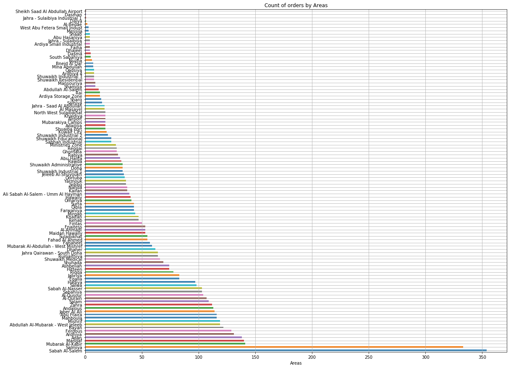

# Explanatory Data Analysis - Fast food chain in Kuwait

<b>Table of Contents:</b>
<b>Libraries Used:</b>
<b>Files Description</b>
<b> My Questions </b>
<b>My findings</b>
<b>Acknowledgments and thanks</b>

<b>Libraries Used:</b>
The project was done on Jupyter Notebook and Python 3.0, below are the libraries used:
1. Matplotlib
2. Seaborn
3. Pandas
4. Numpy
5. Sklearn

<b>Files Description</b>
The files used are raw data of transaction of the restaurant, and all its branches in Kuwait. The files capture the date, amount, time, branch. Date of the data retrieved is April 2018. 

<b> My Questions </b>
There is no purpose in mind when analysing the data, the idea was to see if we can better understand the business and its characteristics. Maybe find new patterns or trends that we can build on.

1. Why some branches sell more at a specific time?
2. Does the day of the week effect orders?
3. Does the amount differ between branches and do other branches have higher order means?

<b>My findings</b>

<b>Time:</b>
Based on the analyses done on the data, time showed some trends that can be expanded on. When placing the orders in a normalized distribution, we can see that most orders are within 1 stdev of the mean, but when the end of the month approaches they jump above the 1 stdev. The only way we can explain this is that salaries get deposited after the 20th of month for all companies in Kuwait. 

The other peaks and valleys we see are the weekends and start of the week. Again, on the weekends, the chain start getting an uptick on his orders.
The chain will start preparing for these spikes by weekend and higher spikes when salaries deposit. This should help with inventory management too. 

Below the images speaks for itself. 

<b>Kuwait Area's in relation to the restaurant chain:</b>

Taking another perspective of the chain’s orders by area's in Kuwait, we found that some area differs completely with others. This perspective also helped in seeing how the chain should place new branches to better address the areas. The analysis also showed that some branches are working overtime and others relatively less.
Two branches of the chain also seem to be taking most of the orders, which will surely need further analyses, to see if these branches are facing and mishaps or mistakes in the orders due to the volume.

<b>Conclusion</b>
The data when analysed from a statical perspective, new information could be found and that can help address certain phenomena within the business. The analyses also shed some light on why some areas order have larger means amounts compared to others. This information can be used to produce new products that address this higher mean group.

<b>Acknowledgments and thanks</b>
Thanks for the ETL team at the restaurant chain for providing the data.
Disclaimer, the name of the restaurant can’t be provided due to privacy issues.

