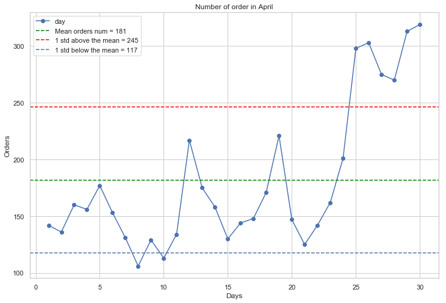

# Explotry Data Analysis - Fast food chain in Kuwait

<b>Table of Contents:</b>
<b>Libraries Used:</b>
<b>Files Description</b>
<b> My Questions </b>
<b>My findings</b>
<b>Acknowledgments and thanks</b>

<b>Libraries Used:</b>
The project was done on Jupyter Notebook and Python 3.0, below are the libraries used:
1. Matplotlib
2. Seaborn
3. Pandas
4. Numpy
5. Sklearn

<b>Files Description</b>
The files used are raw data of transaction of the resutant, and all its brancghes in Kuwait. The files capture the date, amount, time, branch. Date of the data retreived is April 2018. 

<b> My Questions </b>
There is no purpose in mind when analyzing the data, the idea was to see if we can better understand the business and its characteris. Maybe find new patterns or trends that we can build on.

1. Why some branches sell more at a specifc time?
2. Does the day of the week effect orders?
3. Does the amount differ between branches and do other branches have higher order means?

<b>My findings</b>

<b>Time:</b>
Based on the analyses done on the data, time showed some trends that can be expanded on. When palcing the orders in a normilized distrubution, we can see that most orders are within 1 stdev of the mean, but when the end of the month appouches they jump above the 1 stdev. The only way we can exaplin this is that salarries get deposited after the 20th of month for all companies in Kuwait. 

The other peaks and valleys we see are the weekends and start of the week. Again on the weekends, the chain start getting an uptick on his orders.
The chain will start preparing for these spikes by weekend and higher spikes when salaries deposit. This should help with invenotory managemnet too. 

Below the images speaks for itself. 

<b>Kuwait Area's in relation to the resturant chain:</b>

Taking another perspective of the chains orders by area's in Kuwait, we foudn that some area differs completey with orther. This perspective also helped in seeying how the chain should place new branches to better address the areas. The analysis also showed that some branches are working overtime and others relativly less.
Two branches of the chain also seem to be taking most of the orders, which will surley need further analyses, to see if these branches are facing and misshaps or mistakes in the orders due to the volume.

